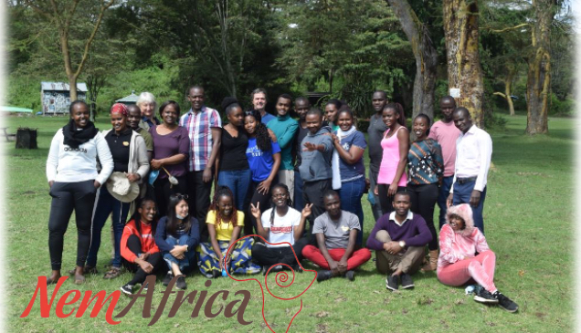

Welcome!

**NemAfrica** is the joint nematology laboratory between International Institute of Tropical Agriculture (IITA) and International Centre of Insect Physiology and Ecology (ICIPE). We mainly work on plant parasitic nematodes as well as entomopathogenic nematodes for better livelihood of smallholder farmers in Sub-Saharan Africa. Please follow us on Twitter [@NemAfrica](https://twitter.com/NemAfrica) and [@DannyCoyne6](https://twitter.com/DannyCoyne6).

This webpage serves as an archive of our publications, announcements of seminars for members within as well as promotions of our team for people who are interested in our work.

- [Publication](./publication/)
- [Activity](./activity/)
- [Seminar](./seminar/)
- [Media](./media/)
- [Team](./team/)

